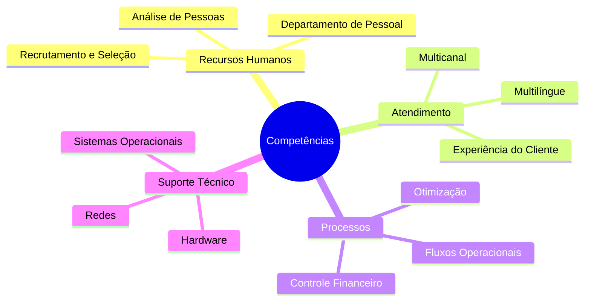
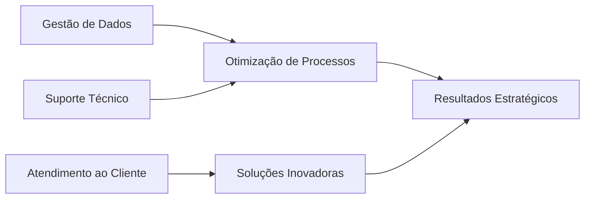

# 👋 Olá, eu sou Virginia Rivas

**💼 Especialista em Recursos Humanos, Operações & Suporte Técnico**  
*Interseção entre RH, Dados e Tecnologia para otimização empresarial*

---

## 🚀 Experiência Multissetorial

  
  
  
  

### 🔍 Principais Competências

🛠️ Conhecimentos Técnicos - 📊 Ferramentas & Sistemas:
---

         

🌐 Habilidades Operacionais
---

📚 Formação Complementar - 🎓 Toti Diversidade | Suporte Técnico:
---

      

Conteúdos dominados:
---
🖥️ Arquitetura de computadores (CPU, RAM, discos, periféricos)

🌐 Redes e protocolos (topologias, segurança cibernética)

💿 Sistemas Operacionais (Windows, Linux, macOS)

📞 Service Desk (gestão de incidentes e solicitações)

🧩 Lógica de programação para troubleshooting

📘 ITIL v4 Foundation (gestão de serviços de TI)

💡 Proposta de Valor:
---
"Transformo complexidade operacional em eficiência estratégica através da sinergia entre pessoas, dados e tecnologia, garantindo segurança da informação e experiências excepcionais para clientes e stakeholders."

🌐 Conecte-se Comigo:
---

   

